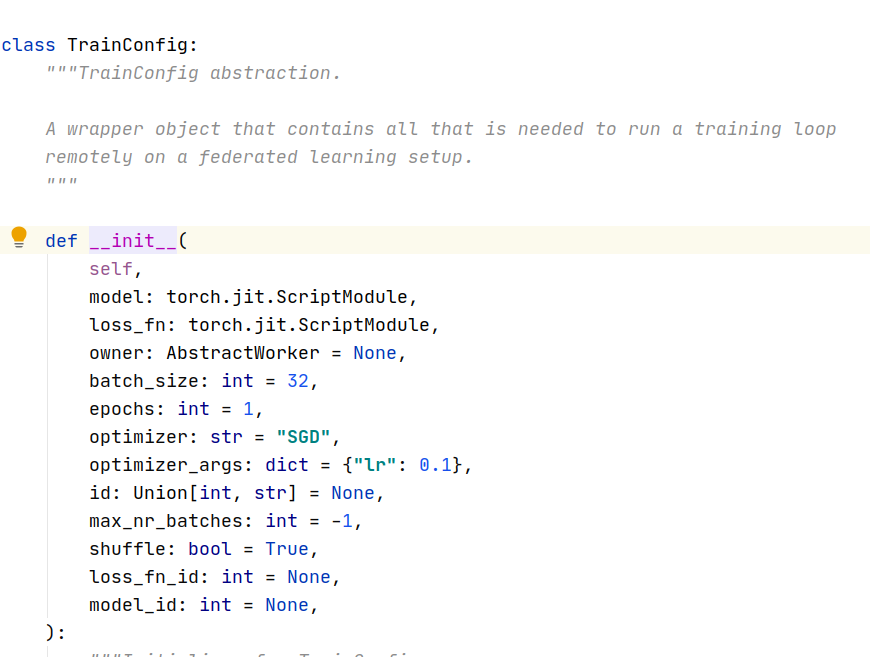
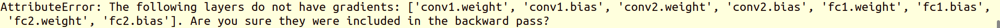

# 3月3日

## 问题：

1. `pysyft 0.2.4`能否使用websockets调用差分隐私算法？ 
2. [`pysyft 0.2.4`smpc能有在实现？](https://blog.openmined.org/encrypted-deep-learning-classification-with-pysyft/)
3. smpc能否应用到分布式部署？
4. Flower实现差分隐私？

## 解决:

### 问题1：

#### 1.1 websockets-example-MNIST-parallel

对于`websockets-example-MNIST-parallel`不能实现差分隐私，在模型参数的方法里就已经规定好optimizer的接收的是个`string`字符串

#### 1.2 websockets-example-MNIST-parallel

`websockets-example-MNIST`同样不支持差分隐私操作，因为`optimizer`访问到的权重和偏执是指针，没有办法裁剪。

### 问题2：

2.1 