# git分支+Pycharm 

## 一、什么是git分支？

## 二、新建分支

### 1. 远程创建分支

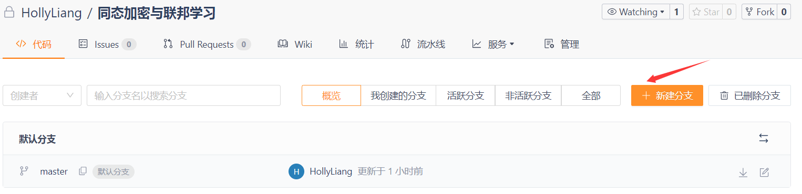

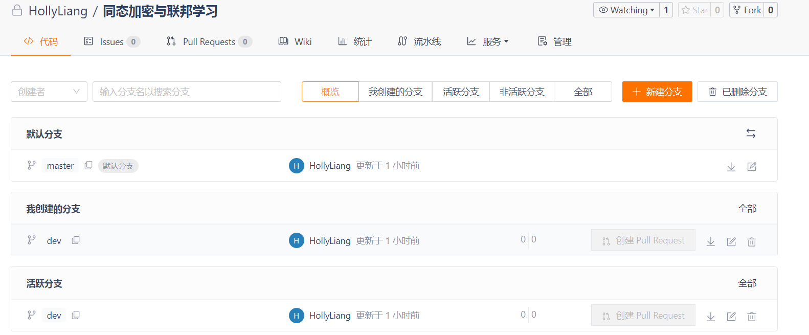

### 2. 本地刷新

#### 2.1 点击刷新

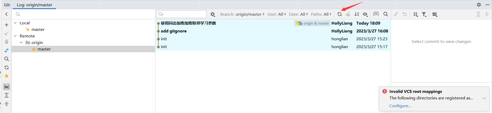

#### 2.2 或者更新项目

#### 2.3 查看

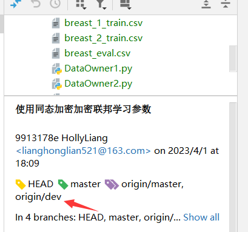

### 3. 本地新建分支

点击master，选择新建分支

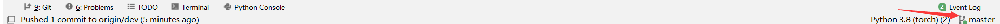

## 三、修改代码

## 3.1 commit

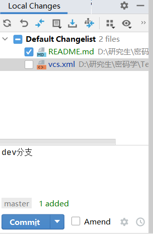

## 3.2 push远程分支

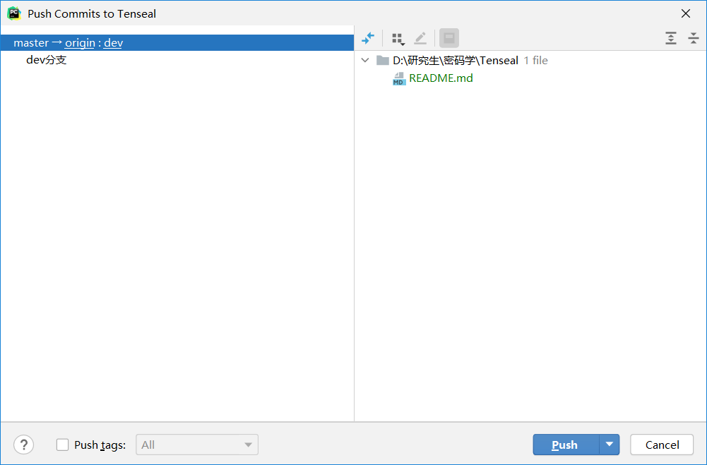

**可以观察到master分支没有改变**

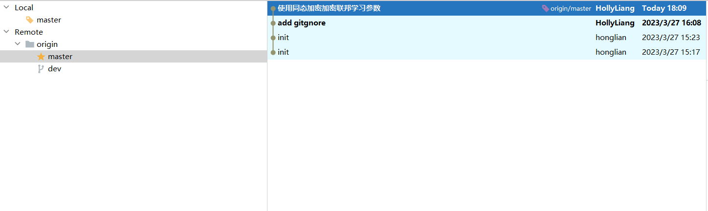

**Dev分支有改变**

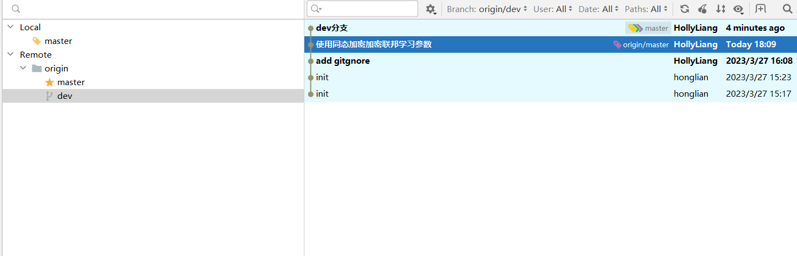

## 四、切换分支

在右下角点击切换分支，选择`checkout`

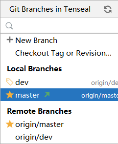

## 五、合并分支

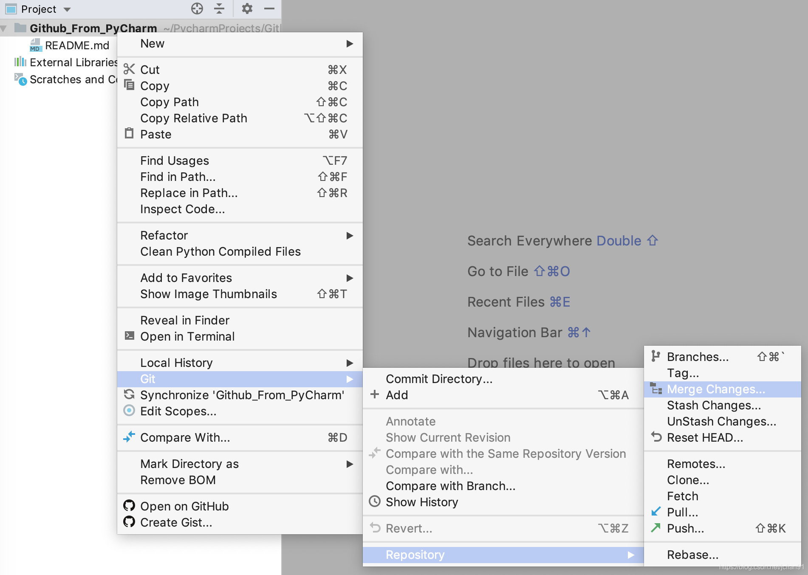