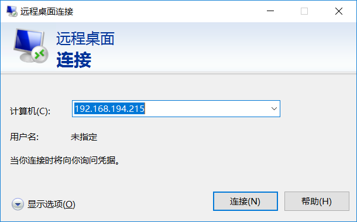
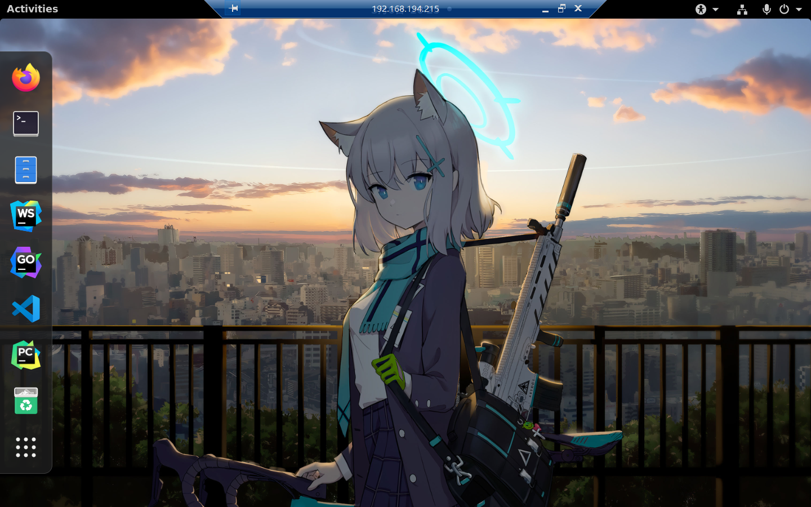

# win10远程桌面连接Ubuntu20.4

## 一、内网穿透

### 1. 使用[ZeroTier](https://my.zerotier.com/network)创建网络

### 2. 设备安装ZeroTier客户端，加入网络

#### 2.1 linux设备安装

1、在线安装zerotier

curl -s https://install.zerotier.com/ | sudo bash

2、添加开机自启

```
$ sudo systemctl enable zerotier-one.service
```

3、启动zerotier-one.service

```
$ sudo systemctl start zerotier-one.service
```

4、加入网络

```
$ sudo zerotier-cli join 网络识别码
```

#### 2.2 Windows设备安装（略）

#### 2.3 在ZeroTier上同意设备加入网络

## 二、Ubuntu安装xrdp

1、安装 xrdp

```
sudo apt-get install xrdp
```

2、开启[rdp](https://so.csdn.net/so/search?q=rdp&spm=1001.2101.3001.7020)服务

```
systemctl start xrdp
```

3、使 rdp 开机自启

```
systemctl enable xrdp
```

**遇到问题，连接黑屏**

修改配置：

```
sudo vi /etc/xrdp/startwm.sh
```

添加以下两句

```
unset DBUS_SESSION_BUS_ADDRESS

unset XDG_RUNTIME_DIR
```

在此处上面添加

```
if test -r /etc/profile; then

. /etc/profile fi
```

重启 xrdp 服务：

```
sudo systemctl restart xrdp
```

## 三、Windows开启远程桌面

### 3.1 输入ZeroTier提供的IP地址



### 3.2 连接成功



## 四、使用Ubuntu原生主题

如果不做任何配置，启动之后的桌面是非常别扭的，因为是Gnome的原始桌面，没有左侧的任务栏，窗口也没有最小化按钮，等等一些列问题。解决方案也很简单：

### 1. 添加配置文件

```text
vim ~/.xsessionrc

添加：

export GNOME_SHELL_SESSION_MODE=ubuntu
export XDG_CURRENT_DESKTOP=ubuntu:GNOME
export XDG_CONFIG_DIRS=/etc/xdg/xdg-ubuntu:/etc/xdg
```

### 2. 重启xrdp服务

```text
sudo systemctl restart xrdp.service
```

此时再连接，你将得到与原生桌面完全一样的效果！

## 参考链接

[linux 安装配置zerotier](https://www.shuzhiduo.com/A/ZOJPWq2Ozv/)

[win10远程桌面连接ubuntu20(RDP)](http://www.glaciers.com.cn/2022/09/ubuntu-xrdp/)

[Windows远程桌面连接Ubuntu图文教程](https://www.idcspy.com/58552.html)

[完美方案——解决XRDP连接黑屏，以及桌面优化！](https://zhuanlan.zhihu.com/p/519648451)

