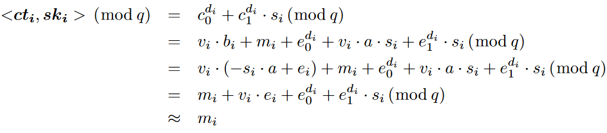
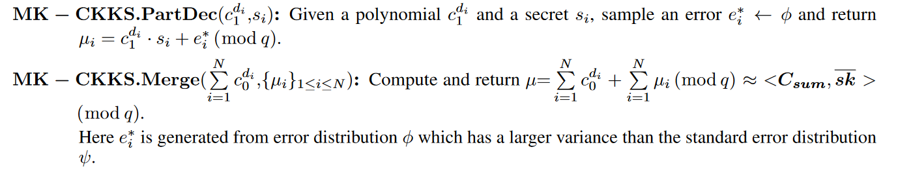

# MK-CKKS

## 1 **MK-CKKS** 

是一种基于错误环学习 (RLWE) 的同态加密方案。  

$$
R=\mathbb{Z}[X]/(X^n+1)
$$
$$R$$是分圆环，$$n$$是2的幂次，$$\mathbb{Z}[X]$$是整数系数的多项式环，$$R$$中的元素满足$$X^n=-1$$。$$\:R_{q}=\mathbb{Z}_{q}[X]/(X^{n}+1)\:$$是 $$R$$ 的残差环[^1]，其系数以整数 $$q$$ 为模。（$$R_q=\mathbb{Z}_q[X]/(X^n+1)$$ 表示模 $$q$$ 的多项式环 $$\mathbb{Z}_q[X]$$ 通过关于多项式 $$X^n+1$$的同余关系构造出的一个剩余类环。)

对于参数 $$(n,q,\chi,\psi)$$，我们的 RLWE 假设是，给定形式为 $$\:(a,b=s\cdot a+e)\in R_q^2\text{,}\:$$的多项式，当从 $$R_q$$ 中均匀随机选择 $$a$$ 时，项$$b$$ 在计算上无法与 $$R_q$$ 的均匀随机元素区分开来，$$s$$ 从 $$R_q $$上的密钥分布$$\chi$$ 中选择，$$e$$ 从 $$R$$ 上的C错误分布 $$\psi$$ 中抽取的 。

我们用粗体表示向量，并使用$$\langle\mathbf{u},\mathbf{v}\rangle$$ 表示两个向量 u 和 v 的点积。$$x\leftarrow\Gamma\text{}$$表示根据分布 Γ 对 x 进行采样。λ 表示整篇论文的安全参数。$$g\in Z^{d}\quad\text{}$$是一个积分向量，called the gadget vector。MK-CKKS 假定公共参考字符串 (CRS) 模型，因此所有设备共享一个随机多项式向量 $$\mathbf{a}\leftarrow U(R_{q}^{d})$$，这里 U (·) 表示均匀分布。设$$\textit{sk}_\mathbf{i}=(1,s_i)$$ 作为密钥 $$s_i$$，$$\overline{\mathbf{sk}}=(1,s_{1},...s_{N})$$用于连接多个密钥。$$\mathbf{c t_i}=(c_0^{d_i},c_1^{d_i})$$是明文$$m_i$$的密文来自远程设备 $$\ d_i$$，$$\text{}i=1,\ldots,N$$

## 2 设置

对于给定的安全参数 $$\lambda$$，设置 RLWE 维数 $$n$$、密文模数 $$q$$、密钥分布 $$\begin{array}{c}\chi\end{array}$$ 和误差分布$$\psi$$ 在 $$R$$上。生成一个随机向量。返回公共参数$$(n,q,\chi,\psi)$$。远程设备 $$d_{i}$$生成其秘密密钥 $$\:s_{i}\leftarrow\chi\:$$，并计算其公钥为 $$\mathbf{b_{i}}=-s_{i}\cdot\mathbf{a}+\mathbf{e_{i}}\in R_{q}^{2}$$，此处 $$\mathbf{e}_{i}$$是从 $$R$$ 上的误差分布 $$\psi$$ 中得出的误差向量。

## 3 编码和解码

在加密之前，首先将一个复数展开为一个向量，复数规范嵌入映射将其编码为环R的多项式。解码将解密后的多项式转换为复数向量。

## 4 加密

将消息向量编码为明文 $$m_i$$（即分圆环的元素）后，$$d_i$$ 将 $$m_i$$加密为密文 $$\mathbf{c t_i}=(c_0^{d_i},c_1^{d_i})$$其中$$\:c_0^{d_i}=v_i\cdot b_i+m_i+e_0^{d_i}\:(\mathrm{mod}\:q)\:$$ 和$$c_{1}^{d_{i}}=v_{i}\cdot a+e_{1}^{d_{i}}\:(\mathrm{mod}\:q)$$。这里$$\ a=\mathbf a\text{}[0]\:$$ 和 $$\ b_i=\textbf{b}_i[0]$$,$$\:v_{i}\leftarrow\chi\:$$ 和 $$e_{0}^{d_{i}},e_{1}^{d_{i}}\leftarrow\psi$$。插入小错误以确保安全，并且可以在执行同态操作后通过舍入操作将其删除。在 MK-CKKS 中，与 N 个不同方相关联的附加密文的形式为$$\mathbf{C}_{\mathrm{sum}}\stackrel{\mathrm{def}}=\left(\sum_{i=1}^{N}c_{0}^{d_{i}},c_{1}^{d_{1}},c_{1}^{d_{2}},\ldots,c_{1}^{d_{N}}\right)\in R_{q}^{N+1}$$

**Decryption of individual ciphertext**. $$d_i$$ 计算$$\textit{sk}_\mathbf{i}=(1,s_i)$$和 $$\mathbf{c t_i}=(c_0^{d_i},c_1^{d_i})$$的点积，如下所示

## 5 加法同态

设$$\mathbf{c t_i}=(c_0^{d_i},c_1^{d_i})$$ 和$$\mathbf{c t_j}=(c_0^{d_j},c_1^{d_j})$$ 是来自远程设备 $$d_i$$ 和 $$d_j$$ 的明文消息 $$m_i$$ 和 $$m_j$$ 的两个密文。密文的总和是$$\mathbf{C}_{\mathrm{sum}}\stackrel{\mathrm{def}}=(c_{0}^{d_{i}}+c_{0}^{d_{j}},c_{1}^{d_{i}},c_{1}^{d_{j}})$$它可以通过计算 $$C_{s u m}$$ 和$$\overline{\mathbf{s k}}=(1,s_{i},s_{j})$$ 的点积来解密。正确性证明如下：

## 6 解密总和

 MK-CKKS 中引入了基于噪声泛洪的分布式解密，因为假设任何一方都持有多个密钥是不合理的。解密包括两种算法：部分解密和合并。

[^1]: 残差环（Residue Ring）是一个环的剩余类环。给定一个环 $$R$$ 和一个理想 $$I$$，则 $$I$$ 中的每个元素 $$a$$ 都可以对 $$R$$ 中的每个元素取模得到一个剩余类 $$[a]$$。所有这些剩余类构成一个新的环，称为 $$R$$ 对 $$I$$ 的剩余类环，记作 $$R/I$$。具体来说，$$R/I$$ 中的元素是形如 $$[a]$$ 的剩余类，其中 $$a\in R$$ 且 $$[a]=[b]$$ 当且仅当 $$a-b\in I$$。$$R/I$$ 中的加法和乘法运算分别定义为： $$[a]+[b]=[a+b]$$ $$[a]\cdot[b]=[ab]$$在密码学中，残差环常被用于构造离散对数问题，从而实现公钥密码学中的加密和签名算法，如 Diffie-Hellman 密钥交换、ElGamal 加密、DSS 签名等。常用的残差环包括模素数的剩余类环 $$\mathbb{Z}/p\mathbb{Z}$$，以及模多项式的剩余类环 $$R_q=\mathbb{Z}_q[X]/(f(X))$$，其中 $$f(X)$$ 是一个不可约多项式

