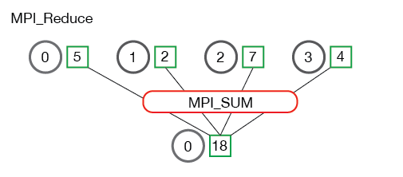

## 集合通信

和P2P通信相对应，集合通信则是1对多或是多对多的。在分布式系统中，各个节点间往往存在大量的集合通信需求，而我们可以用**消息传递接口(Message Passing Interface, MPI)**来定义一些比较底层的消息通信行为譬如**Reduce、Allreduce、Scatter、Gather、Allgather**等。常用的通信模式有：

- **Broadcast**
- **Scatter**
- **Gather**
- **Reduce**
- **All reduce**
- **All gather**

**AllReduce**其实是一类算法，目标是高效得将不同机器中的数据整合（reduce）之后再把结果分发给各个机器。在深度学习应用中，数据往往是一个向量或者矩阵，通常用的整合则有Sum、Max、Min等。

## 1. All reduce（reduce+broadcast）

AllReduce具体实现的方法有很多种，最单纯的实现方式就是每个worker将自己的数据发给其他的所有worker，然而这种方式存在大量的浪费。

### 1.1 reduce

reduce称为规约运算，是一系列运算操作的统称，细分来说包括SUM、MIN、MAX、PROD、LOR等。reduce意为减少/精简，因为其操作在每个进程上获取一个输入元素数组，通过执行操作后，将得到精简的更少的元素。例如下面的**Reduce sum**：

### 1.2 broadcast

broadcast代表了一种广播的行为，执行broadcast时，数据从主节点广播至其他各个指定的节点；和broadcast类似，scatter表示一种散播行为，将主节点的数据划分散布至其他指定的节点。

reduce是一系列操作的统称，**all reduce则是在所有的节点进程上都应用同样的reduce操作。** **All reduce sum：**

**从图中可以看出，all reduce操作可通过单节点上reduce+broadcast操作完成。**

## 2. 主从式架构

一个略优的实现是利用主从式架构，将一个worker设为master，其余所有worker把数据发送给master之后，由master进行整合元算，完成之后再分发给其余worker。不过这种实现master往往会成为整个网络的瓶颈。

## 3. Ring All Reduce

Ring AllReduce算法分为两个阶段。

第一阶段，将N个worker分布在一个环上，并且把每个worker的数据分成N份。

接下来我们具体看第k个worker，这个worker会把第k份数据发给下一个worker，同时从前一个worker收到第k-1份数据。

之后worker会把收到的第k-1份数据和自己的第k-1份数据整合，再将整合的数据发送给下一个worker。

以此循环N次之后，每一个worker都会包含最终整合结果的一份。

第二阶段，每个worker将整合好的部分发送给下一个worker。worker在收到数据之后更新自身数据对应的部分即可。

假设每个worker的数据是一个长度为S的向量，那么个Ring AllReduce里，每个worker发送的数据量是O(S)，和worker的数量N无关。这样就避免了主从架构中master需要处理O(S*N)的数据量而成为网络瓶颈的问题。

## 参考资料

[NCCL、OpenMPI、Gloo对比](https://blog.csdn.net/taoqick/article/details/126449935)

[关于AllReduce](https://zhuanlan.zhihu.com/p/100012827)

[torch.distributed.all_reduce的架构介绍](https://github.com/tczhangzhi/pytorch-distributed)

[分布式通信包 - torch.distributed](https://www.jianshu.com/p/5f6cd6b50140)

[PyTorch torch.distributed官方文档](https://pytorch.org/docs/stable/distributed.html)