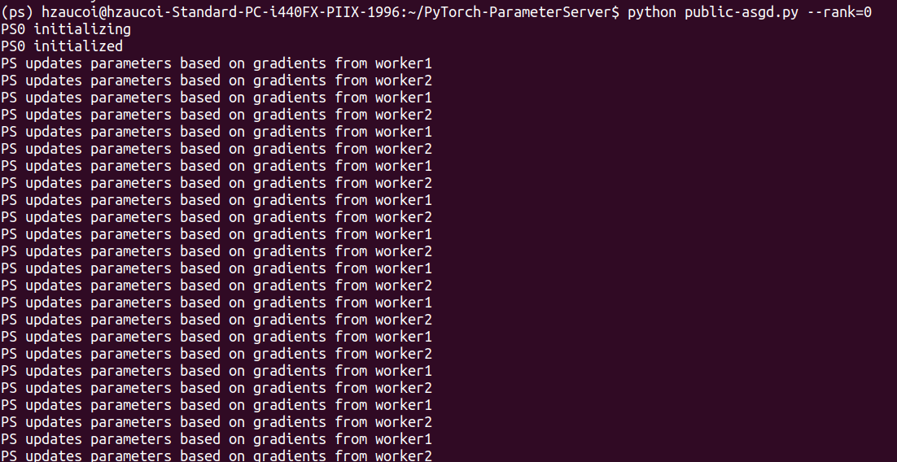
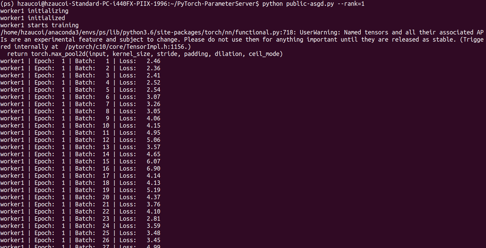

# PyTorch-Parameters Server

[仓库](https://github.com/xbfu/PyTorch-ParameterServer.git)

## 代码

```python
import argparse
import os
import threading
import time

import torch
from torch import optim
import torch.nn as nn
from torch.utils.data import DataLoader
import torch.distributed.rpc as rpc
from torchvision import transforms, datasets, models

model_dict = {'resnet18': models.resnet18, 'resnet50': models.resnet50, 'vgg16': models.vgg16, 'alexnet': models.alexnet,
              'googlenet': models.googlenet, 'inception': models.inception_v3,
              'densenet121': models.densenet121, 'mobilenet': models.mobilenet_v2}


class ParameterServer(object):
    """"
     The parameter server (PS) updates model parameters with gradients from the workers
     and sends the updated parameters back to the workers.
    """
    def __init__(self, model, num_workers, lr):
        self.lock = threading.Lock()
        self.future_model = torch.futures.Future()
        self.num_workers = num_workers
        # initialize model parameters
        assert model in model_dict.keys(), \
            f'model {model} is not in the model list: {list(model_dict.keys())}'
        self.model = model_dict[model](num_classes=10)
        # zero gradients
        for p in self.model.parameters():
            p.grad = torch.zeros_like(p)
        self.optimizer = optim.SGD(self.model.parameters(), lr=lr, momentum=0.9)

    def get_model(self):
        return self.model

    @staticmethod
    @rpc.functions.async_execution
    def update_and_fetch_model(ps_rref, grads, worker_rank):
        self = ps_rref.local_value()
        with self.lock:
            print(f'PS updates parameters based on gradients from worker{worker_rank}')
            # update model parameters
            for p, g in zip(self.model.parameters(), grads):
                p.grad = g
            self.optimizer.step()
            self.optimizer.zero_grad()

            fut = self.future_model

            fut.set_result(self.model)
            self.future_model = torch.futures.Future()

        return fut


def run_worker(ps_rref, rank, data_dir, batch_size, num_epochs):
    """
    A worker pulls model parameters from the PS, computes gradients on a mini-batch
    from its data partition, and pushes the gradients to the PS.
    """

    # prepare dataset
    normalize = transforms.Normalize(mean=[0.485, 0.456, 0.406], std=[0.229, 0.224, 0.225])
    transform = transforms.Compose(
        [transforms.RandomResizedCrop(224), transforms.RandomHorizontalFlip(), transforms.ToTensor(), normalize])
    train_dataset = datasets.ImageFolder(root=data_dir, transform=transform)
    train_loader = torch.utils.data.DataLoader(train_dataset, batch_size=batch_size, shuffle=True)

    # set device
    device_id = rank - 1
    # device_id = 0
    device = torch.device(f"cuda:{device_id}" if torch.cuda.is_available() else "cpu")
    criterion = nn.CrossEntropyLoss()

    # get initial model from the PS
    m = ps_rref.rpc_sync().get_model().to(device)

    print(f'worker{rank} starts training')
    tt0 = time.time()

    for i in range(num_epochs):
        for batch_idx, (data, target) in enumerate(train_loader):
            data, target = data.to(device), target.to(device)
            output = m(data)
            loss = criterion(output, target)
            loss.backward()

            print("worker{:d} | Epoch:{:3d} | Batch: {:3d} | Loss: {:6.2f}"
                  .format(rank, (i + 1), (batch_idx + 1), loss.item()))

            # send gradients to the PS and fetch updated model parameters
            m = rpc.rpc_sync(to=ps_rref.owner(),
                             func=ParameterServer.update_and_fetch_model,
                             args=(ps_rref, [p.grad for p in m.cpu().parameters()], rank)
                             ).to(device)

    tt1 = time.time()

    print("Time: {:.2f} seconds".format((tt1 - tt0)))


def main():
    parser = argparse.ArgumentParser(description="Train models on Imagenette under ASGD")
    parser.add_argument("--model", type=str, default="resnet18", help="The job's name.")
    parser.add_argument("--rank", type=int, default=1, help="Global rank of this process.")
    parser.add_argument("--world_size", type=int, default=3, help="Total number of workers.")
    parser.add_argument("--data_dir", type=str, default="./imagenette2/val", help="The location of dataset.")
    parser.add_argument("--master_addr", type=str, default="localhost", help="Address of master.")
    parser.add_argument("--master_port", type=str, default="29600", help="Port that master is listening on.")
    parser.add_argument("--batch_size", type=int, default=64, help="Batch size of each worker during training.")
    parser.add_argument("--lr", type=float, default=0.01, help="Learning rate.")
    parser.add_argument("--num_epochs", type=int, default=1, help="Number of epochs.")

    args = parser.parse_args()

    os.environ['MASTER_ADDR'] = args.master_addr
    os.environ['MASTER_PORT'] = args.master_port

    options = rpc.TensorPipeRpcBackendOptions(num_worker_threads=16, rpc_timeout=0)

    if args.rank == 0:
        """
        initialize PS and run workers
        """
        print(f"PS{args.rank} initializing")
        rpc.init_rpc(f"PS{args.rank}", rank=args.rank, world_size=args.world_size, rpc_backend_options=options)
        print(f"PS{args.rank} initialized")

        ps_rref = rpc.RRef(ParameterServer(args.model, args.world_size, args.lr))

        futs = []
        for r in range(1, args.world_size):
            worker = f'worker{r}'
            futs.append(rpc.rpc_async(to=worker,
                                      func=run_worker,
                                      args=(ps_rref, r, args.data_dir, args.batch_size, args.num_epochs)))

        torch.futures.wait_all(futs)
        print(f"Finish training")

    else:
        """
        initialize workers
        """
        print(f"worker{args.rank} initializing")
        rpc.init_rpc(f"worker{args.rank}", rank=args.rank, world_size=args.world_size, rpc_backend_options=options)
        print(f"worker{args.rank} initialized")

    rpc.shutdown()


if __name__ == "__main__":
    main()
```


## 运行结果

**PS端**



**worker1端**



**worker2端**

