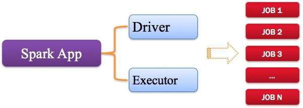

# Spark运行原理

## 一、spark相关概念

### 1.1 Application：Spark应用程序

指的是用户编写的Spark应用程序，包含了Driver功能代码和分布在集群中多个节点上运行的Executor代码。

Spark应用程序，由一个或多个作业JOB组成，如下图所示。

## 参考链接

[Spark运行原理](https://blog.csdn.net/hellozhxy/article/details/120410126)

[Spark入门：DataFrame与RDD的区别](https://dblab.xmu.edu.cn/blog/1089/)