# Spark运行原理

## 一、spark相关概念

### 1.1 Application：Spark应用程序

指的是用户编写的Spark应用程序，包含了Driver功能代码和分布在集群中多个节点上运行的Executor代码。

Spark应用程序，由一个或多个作业JOB组成，如下图所示。

### 1.2 Driver：驱动程序

Spark中的Driver即运行上述Application的**Main()函数**并且创建SparkContext，其中创建SparkContext的目的是为了准备Spark应用程序的运行环境。在Spark中由SparkContext负责和ClusterManager通信，进行资源的申请、任务的分配和监控等；当Executor部分运行完毕后，Driver负责将SparkContext关闭。通常SparkContext代表Driver，如下图所示。

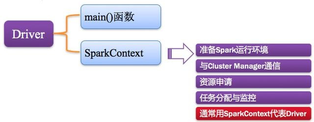

### 1.3 Cluster Manager：资源管理器

指的是在集群上获取资源的外部服务，常用的有：Standalone，Spark原生的资源管理器，由Master负责资源的分配；Haddop Yarn，由Yarn中的ResearchManager负责资源的分配；Messos，由Messos中的Messos Master负责资源管理。

### 1.4 Executor：执行器

Application运行在Worker节点上的一个进程，该进程负责运行Task，并且负责将数据存在内存或者磁盘上，每个Application都有各自独立的一批Executor，如下图所示。

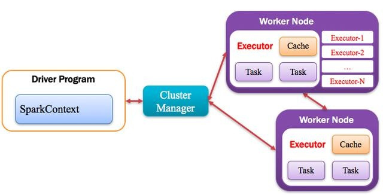

### 1.5 Worker：计算节点

集群中任何可以运行Application代码的节点，类似于Yarn中的NodeManager节点。在Standalone模式中指的就是通过Slave文件配置的Worker节点，在Spark on Yarn模式中指的就是NodeManager节点，在Spark on Messos模式中指的就是Messos Slave节点，如下图所示。

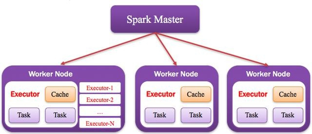

## 二、Spark运行基本流程

当执行一个应用时，Driver会向集群管理器申请资源，启动Executor，并向Executor发送应用程序代码和文件，然后在Executor上执行任务，运行结束后，执行结果会返回给Driver，或者写到HDFS或者其他数据库中。

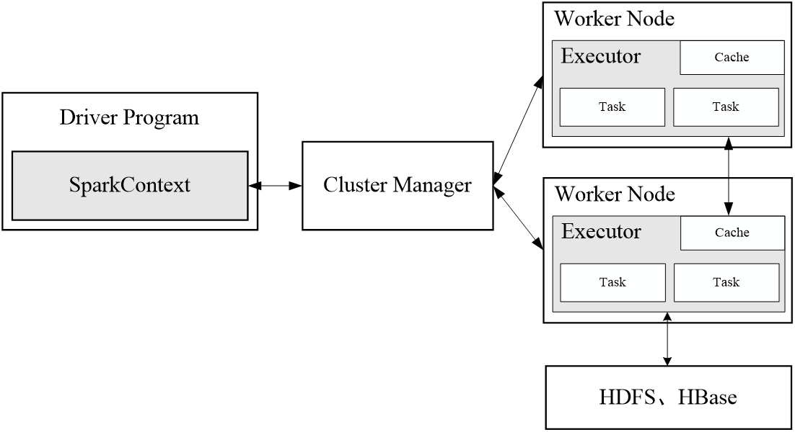

（1）首先为应用构建起基本的运行环境，即由Driver创建一个SparkContext，进行资源的申请、任务的分配和监控

（2）资源管理器为Executor分配资源，并启动Executor进程

（3）SparkContext根据RDD的依赖关系构建DAG图，DAG图提交给DAGScheduler解析成Stage，然后把一个个TaskSet提交给底层调度器TaskScheduler处理；Executor向SparkContext申请Task，Task Scheduler将Task发放给Executor运行，并提供应用程序代码

（4）Task在Executor上运行，把执行结果反馈给TaskScheduler，然后反馈给DAGScheduler，运行完毕后写入数据并释放所有资源 

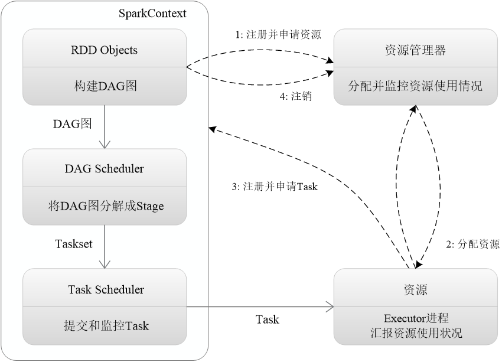

## 三、RDD运行原理

### 3.1 RDD设计背景

- 许多迭代式算法（比如机器学习、图算法等）和交互式数据挖掘工具，共同之处是，不同计算阶段之间会重用中间结果
- 目前的MapReduce框架都是把中间结果写入到稳定存储（比如磁盘）中，带来了大量的数据复制、磁盘IO和序列化开销
- RDD就是为了满足这种需求而出现的，它提供了一个抽象的数据架构，我们不必担心底层数据的分布式特性，只需将具体的应用逻辑表达为一系列转换处理，不同RDD之间的转换操作形成依赖关系，可以实现管道化，避免中间数据存储

### 3.2 RDD(Resillient Distributed Dataset)概念

- 一个RDD就是一个分布式对象集合，本质上是一个只读的分区记录集合，每个RDD可分成多个分区，每个分区就是一个数据集片段，并且一个RDD的不同分区可以被保存到集群中不同的节点上，从而可以在集群中的不同节点上进行并行计算

- RDD提供了一种高度受限的共享内存模型，即RDD是只读的记录分区的集合，不能直接修改，只能基于稳定的物理存储中的数据集创建RDD，或者通过在其他RDD上执行确定的转换操作（如map、join和group by）而创建得到新的RDD

- RDD提供了一组丰富的操作以支持常见的数据运算，分为“动作”（Action）和“转换”（Transformation）两种类型

  RDD提供的转换接口都非常简单，都是类似map、filter、groupBy、join等粗粒度的数据转换操作，而不是针对某个数据项的细粒度修改（不适合网页爬虫）

  表面上RDD的功能很受限、不够强大，实际上RDD已经被实践证明可以高效地表达许多框架的编程模型（比如MapReduce、SQL、Pregel）

  Spark提供了RDD的API，程序员可以通过调用API实现对RDD的各种操作

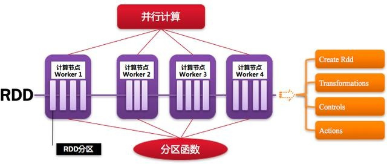

### 3.3 RDD典型执行过程

1. RDD读入外部数据源进行创建
2. RDD经过一系列的转换（Transformation）操作，每一次都会产生不同的RDD，供给下一个转换操作使用
3. 最后一个RDD经过“动作”操作进行转换，并输出到外部数据源 

这一系列处理称为一个Lineage（血缘关系），即DAG拓扑排序的结果

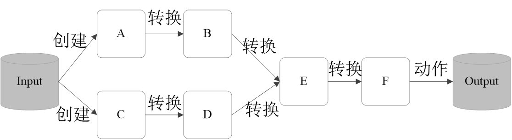

**优点：惰性调用、管道化、避免同步等待、不需要保存中间结果、每次操作变得简单**

### 3.3 RDD特性

Spark采用RDD以后能够实现高效计算的原因主要在于：

（1）高效的容错性

现有容错机制：数据复制或者记录日志

RDD：血缘关系、重新计算丢失分区、无需回滚系统、重算过程在不同节点之间并行、只记录粗粒度的操作

（2）中间结果持久化到内存，数据在内存中的多个RDD操作之间进行传递，避免了不必要的读写磁盘开销

（3）存放的数据可以是Java对象，避免了不必要的对象序列化和反序列化

### 3.4 DAG图阶段划分

#### 3.4.1 窄依赖和宽依赖

**Shuffle操作**

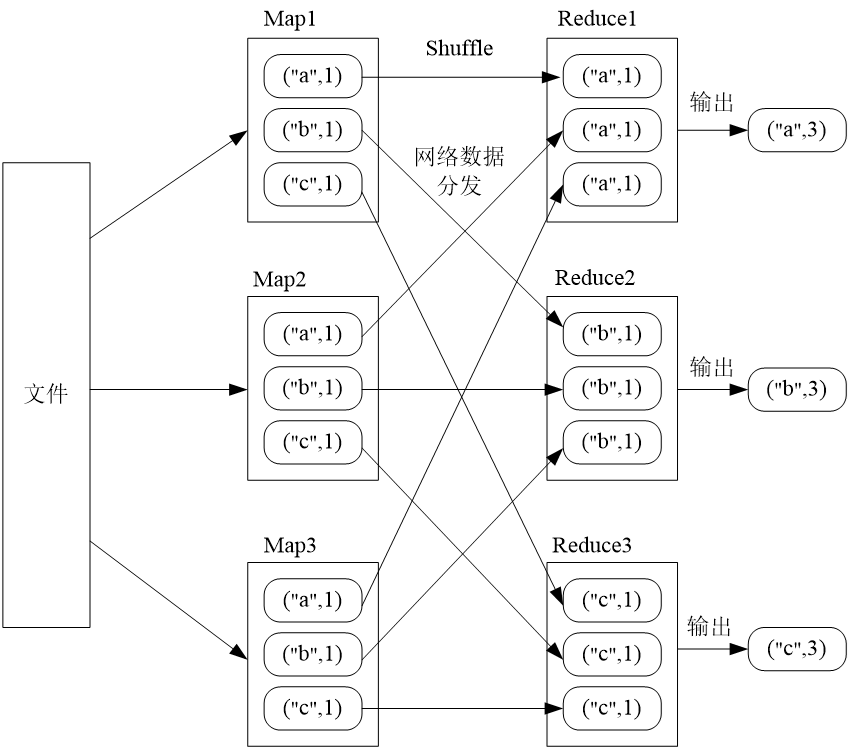

**窄依赖**表现为一个父RDD的分区对应于一个子RDD的分区或多个父RDD的分区对应于一个子RDD的分区，如图所示：

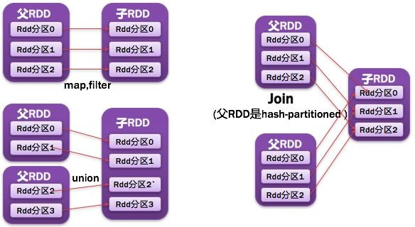

**宽依赖**则表现为存在一个父RDD的一个分区对应一个子RDD的多个分区

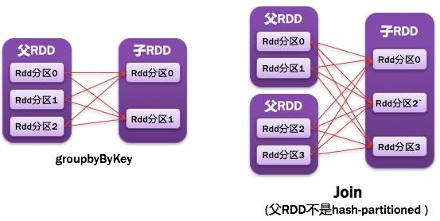

#### 3.4.3 阶段的划分

Spark根据DAG图中的RDD依赖关系，把一个作业分成多个阶段。对于宽依赖和窄依赖而言，窄依赖对于作业的优化很有利。只有窄依赖可以实现流水线优化，宽依赖包含Shuffle过程，无法实现流水线方式处理。举例如图：

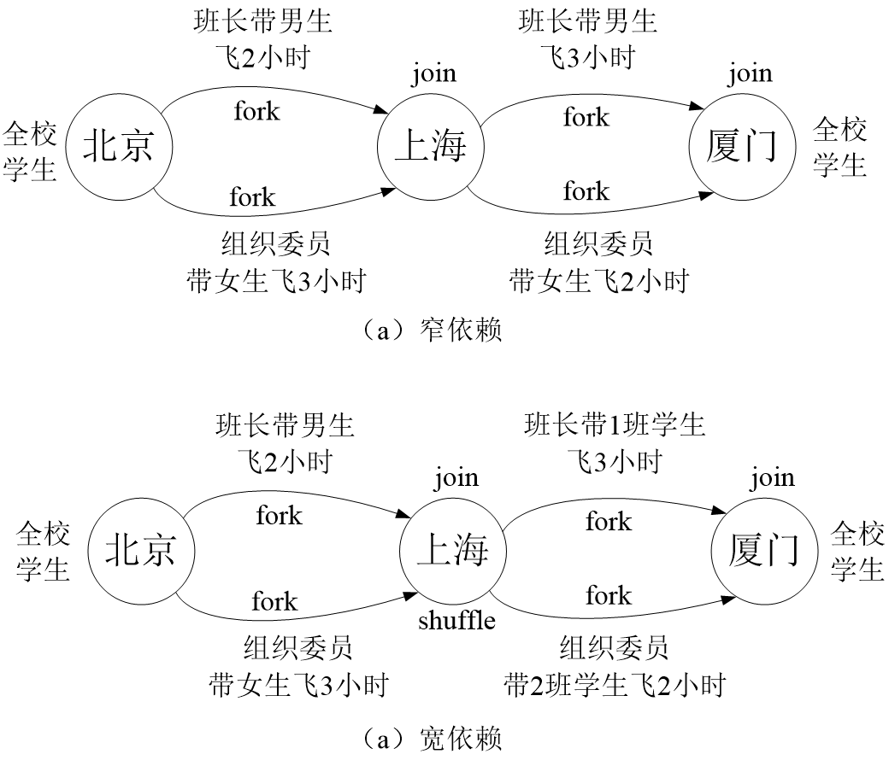

Spark通过分析各个RDD的依赖关系生成了DAG，再通过分析各个RDD中的分区之间的依赖关系来决定如何划分Stage，具体划分方法是：

1. 在DAG中进行反向解析，遇到宽依赖就断开
2. 遇到窄依赖就把当前的RDD加入到Stage中
3. 将窄依赖尽量划分在同一个Stage中，可以实现流水线计算

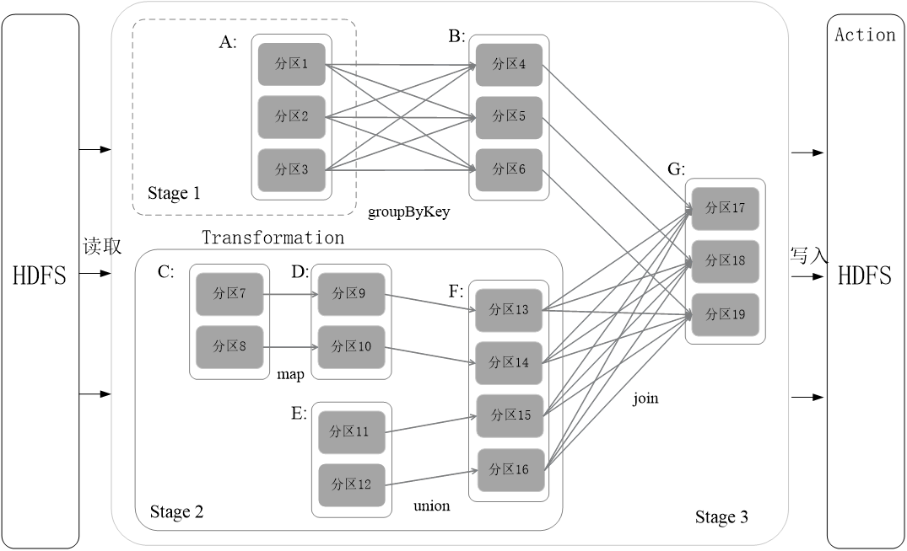

#### 3.4.5 RDD运行过程

（1）创建RDD对象；

（2）SparkContext负责计算RDD之间的依赖关系，构建DAG；

（3）DAGScheduler负责把DAG图分解成多个Stage，每个Stage中包含了多个Task，每个Task会被TaskScheduler分发给各个WorkerNode上的Executor去执行。

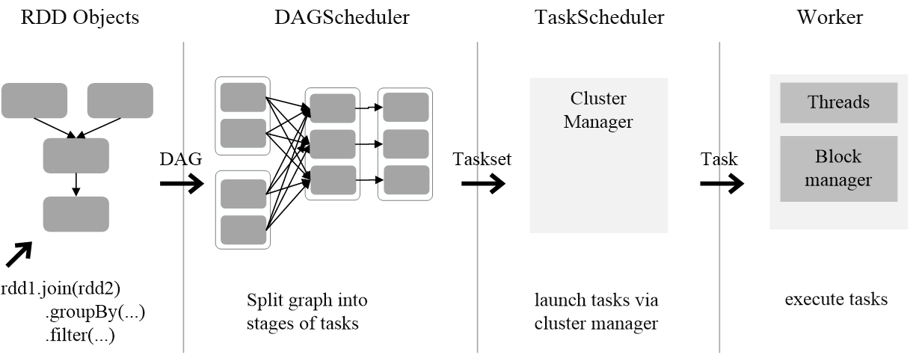

## 四、Spark分布式逻辑回归

Logistic Regression模型的训练过程主要包含两个计算步骤：一是根据训练数据计算梯度，二是更新模型参数向量w。计算梯度（gradient）时需要读入每个样例，代入梯度公式计算，并对计算结果进行加和。由于在计算时每个样例可以独立代入公式，互相不
影响，所以我们可以采用“数据并行化”的方法，即将训练样本划分为多个部分，每个task只计算部分样例上的梯度，然后将这些梯度进行加和得到最终的梯度。在更新参数向量w时，更新操作可以在一个节点上完成，不需要并行化。

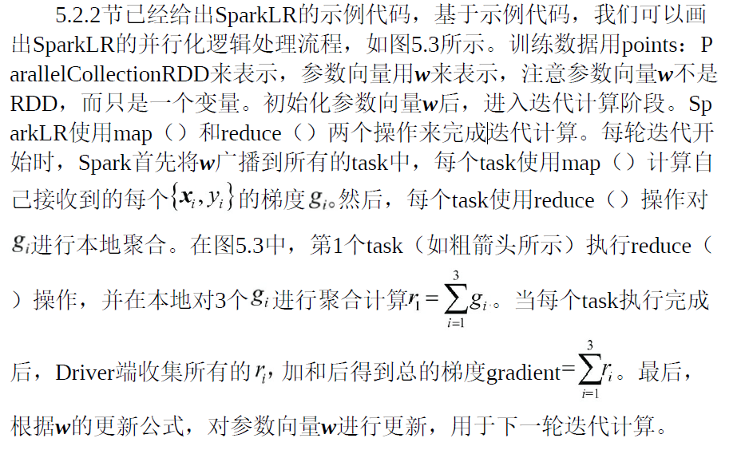

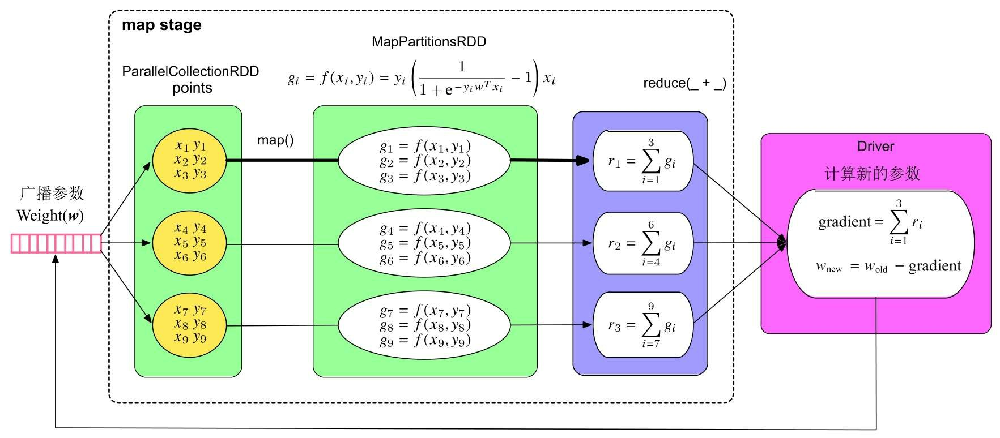

上面我们已经展开讨论了SparkLR的并行化逻辑处理流程，那么，SparkLR在实际运行时生成什么样的job和stage呢？当我们把迭代轮数设为5时，形成的job和stage如图5.4所示。可以看到在这个例子中，SparkLR一共生成了5个job，每个job只包含一个map stage。一个有趣的现象是，第1个job运行需要0.8s（800 ms），而第2个到第5个job只需要56～76ms。发生这一现象的原因是，SparkLR在第1个job运行时对训练数据（points：RDD）进行了缓存，使得后续的job只需要从内存中直接读取数据进行计算即可，这大大减小了数据加载到内存中的开销，从而加速了计算过程。

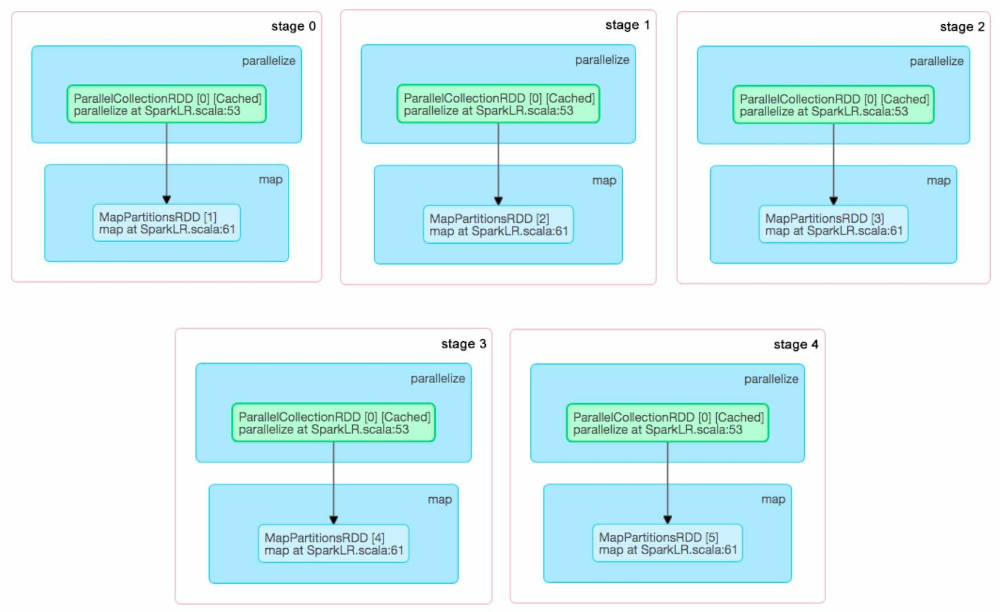

## 参考链接

[Spark运行原理](https://blog.csdn.net/hellozhxy/article/details/120410126)

[Spark入门：DataFrame与RDD的区别](https://dblab.xmu.edu.cn/blog/1089/)

许利杰_ 方亚芬 - 大数据处理框架Apache Spark设计与实现（全彩） (2020, 电子工业出版社) 